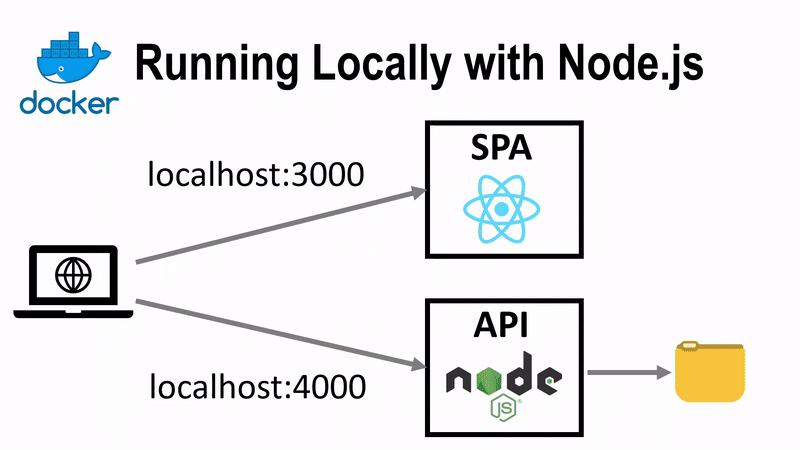
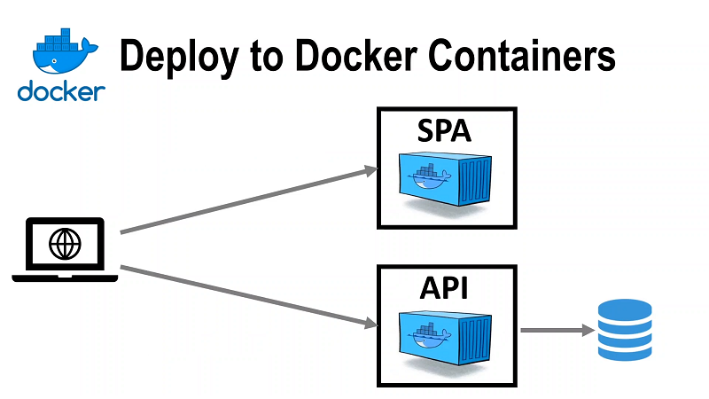
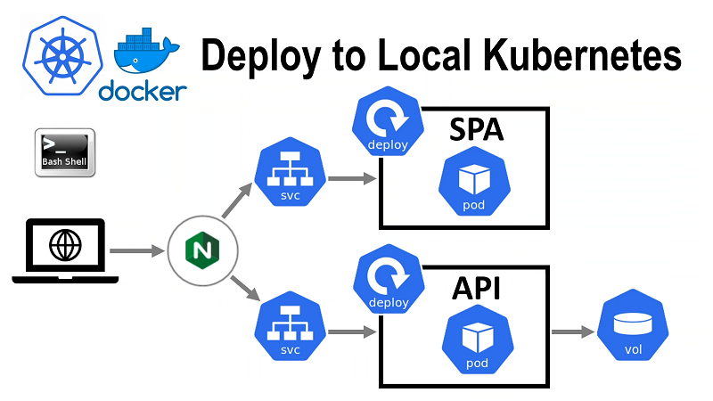
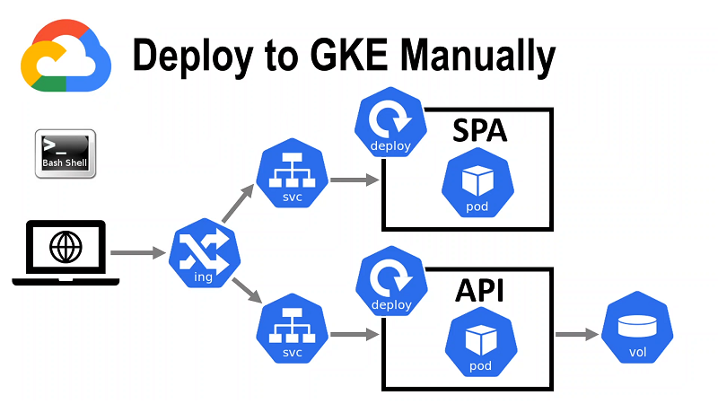
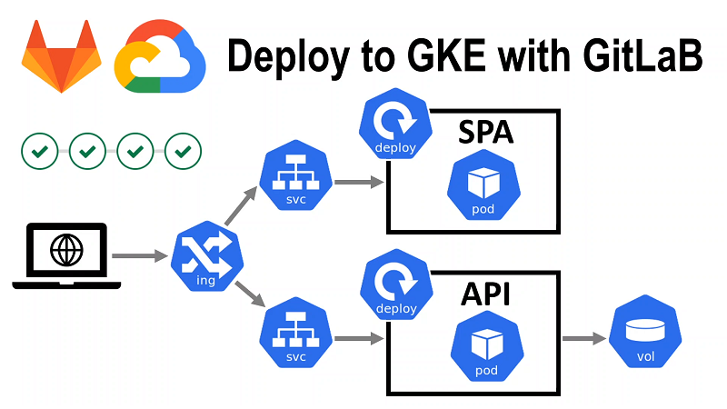

# Deploying to Kubernetes with GitLab


This is the next article of a series started with the [previous tutorial on team work using GitLab](https://devops.redpill.solutions/articles/introduction-to-continuous-delivery-with-gitlab). The focus of the previous article was on continuous delivery in team work. This article provides practical guidance on deploying from GitLab to Kubernetes.

That is, we'll take the simplest possible yet still contentual React.js application, dockerize it, then deploy it to Kubernetes locally using Docker Desktop. After, we'll deploy it to Google Cloud Platform (GCP) and will follow up with designing a CI/CD pipeline in GitLab to publish our application to Google Kubernetes Engine (GKE).

You will benefit from having a basic understanding of
- Docker;
- Kubernetes;
- Git;
- Node.js;
- React;
- Bash.

We'll do the following.
- 🧱 Get familiar with our application, discuss its parts.
- 🐳 Dockerize our application.
- ☸️ Deploy our application to Kubernetes locally on Docker Desktop.
- ☁️ Discuss GCP features, and how we need to change the application. Then we once again deploy our application to Kubernetes, but this time to GCP.
- 🦊 Wrap up our tutorial by creating a pipeline for deploying the application to GCP using GitLab.




From time to time, I will ask you to do something. Such moments are marked with a 🛠️ sign. Please follow the steps as you read the text to get the most out of the tutorial.

⚙️ In order to go through this tutorial, you need these programs to be installed on your computer.
- Bash Shell
- Git
- Node.js
- Docker Desktop
- A modern web browser

The commands in the text are in `bash` format, and some of them use the `git` command line client. If you are using Windows, the easiest way to get both is to install [Git for Windows](https://git-scm.com/downloads).

Further, we will assume that the directories with `node`,` git`, `docker` and` kubectl` binaries are included in `PATH`.

## 🧱 Get familiar with the application

📢 Introduction to the application will include these steps.
- Clone the repository and find out what our application consists of.
- Launch the application in the console.
- See what the application will be in the future in the deployed state.

### What the application consists of

🛠️ Clone the repository and go to the application directory
```bash
git clone https://github.com/ntaranov/gitlab-kubernetes
cd gitlab-kubernetes
```

The app has two parts
- Single Page Application (**SPA**) - a static React site that receives and modifies data by sending AJAX requests to the API service.
- **API** - a web service that provides data about user "registrations" and can add new data. The API writes data that needs to be persisted to a file. We use a file to avoid unnecessary complexity, which would be introduced by working with the database. Additionally, the file allows us highlight persistent volumes.

Why to use such an application for the tutorial? Well, this is the simplest application that meets the following criteria.
- Uses a modern web framework(React.js) requiring code compilation.
- Requires passing a parameter(`API_URL`) at the build time.
- Contains server-side code.
- Includes a Front End and API for emulating microservice architecture.
- Has some persistent state.
- Contains tests.

I aimed to keep the application as simple as possible, so I deliberately didn't include things like this:
- authentication and authorization;
- logs and telemetry;
- error handling;
- interaction with database;
- any meaningful test coverage.

The goal of the tutorial is to provide a minimal example of deploying to Kubernetes and building a pipeline in GitLab. Even with all the simplifications, the tutorial ended up being quite huge.

Inside the newly cloned repository, there will be files and directories:
```javascript
api                 // Directory with API files
  /data/log         // We will save data here
  /package.json     // API NPM manifest
  /server.js        // API code, does not require installing other packages
spa                 // Directory with SPA files
  /public/.         // React standard static files
  /src
    /components
      /Log.jsx      // This component sends API requests
    /App.js         // Main SPA application component
    /App.test.js    // Tests, we must have some tests
    /config.js      // Loads an API URL from an environment variable
    /index.js       // React application root
  /package.json     // SPA NPM manifest
  /package-lock.json  // Worked with these versions of packages
```

The rest of the files are either standard for `create-react-app`, or are secondary for our task.

Note that the component in the file `./spa/src/components/Log.jsx` gets the value of the environment variable `REACT_APP_API_URL` using the code from `./spa/src/config.js`. If nothing is passed, the code will use a default value good for running on local machine, but if we want to deploy the code elsewhere, we need to set the environment variable to a real value at the build stage, before executing `npm run build`.

### Launching locally


Run **API** and **SPA**. The easiest way to do this is by opening two console windows.

🛠️ In the first window, run **API**.
```bash
cd api
node server.js
```

🛠️ In the second window, run **SPA**.
```bash
cd spa
```

1. Install **npm** packages according to `package-lock.json`.
    ```
    npm ci
    ```
2. **SPA** was created with `create-react-app`. Therefore, we will launch it using the development server from `react-scripts`.
    ```
    npm run start
    ```

🛠️ Open **SPA** in your browser at
```
http://localhost:3000/
```

🛠️ Click the **Log Me!** button. An AJAX request will be sent to the address `http://localhost:3000/log` and the User Agent data of the current user
will be saved to the file `./data/log`. The new data will be displayed on the page below the button.

Why does **API** running on port `4000` receive a request intended for `http://localhost:3000/log`? Actually, the `create-react-app` development server can work as a proxy, and redirects requests to `http://localhost:4000/log`. The corresponding setting is in `./spa/package.json`, notice the last line
```json
  "proxy": "http://localhost:4000"
```

You can run tests for **SPA** with the command
```
npm run test
```

You can prepare a static site for placement on production with the command
```
npm run build
```

### What do we want to see in the end?

The target architecture can be displayed in this picture.


For simplicity, we store data in a file, but if we move to storing data in a database, our architecture will become highly available.

First of all, we need to package our application as a Docker container image.

## 🐳 Let's dockerize our application



A good introduction to Docker basics [available on the official site](https://docs.docker.com/get-started/).

📢 In order to dockerize our application, we first dockerize **API** and then **SPA**.

🛠️ Go to the directory `./api` and create a `Dockerfile` with this code inside.
```dockerfile
# use Alpine Linux to create a smaller image
FROM node: 16-alpine
WORKDIR /app
RUN mkdir data
# copy the service code
COPY server.js ./
CMD ["node", "server.js"]
```

🛠️ Make sure Docker Desktop is running. Run local build and tag the image with `gitlab-course-api`
```bash
docker build . -t gitlab-course-api
```

🛠️ Run a container based on the image
```bash
docker run --publish 4000:4000 -d gitlab-course-api
```
This command will output the container hash, which you can use to stop the container later.
Check that the service returns a test string when requesting `http://localhost:4000/log`.

### Dockerizing SPA

🛠️ Same as with **API** let's add  `Dockerfile` to `./spa` directory.
```dockerfile
# build environment
FROM node:14-alpine as builder
WORKDIR /app
ENV PATH /app/node_modules/.bin:$PATH

# copy React source codes into the build image
COPY package.json ./
COPY package-lock.json ./
COPY src ./src
COPY public ./public

# install NPM packages according to package-lock.json
RUN npm ci

# this param needs to be supplied as --build-arg when building the image
ARG API_URL
# building the react application using the param
RUN REACT_APP_API_URL=$API_URL npm run build

# production environment
FROM nginx:stable-alpine
# copy the static site build result from our "heavy" build container
# with NPM packages installed to a slim nginx web server image
COPY --from=builder /app/build /usr/share/nginx/html
EXPOSE 80
CMD ["nginx", "-g", "daemon off;"]
```

In this case,  `Dockerfile` ended up being more complex. In order to understand why there are such difficulties, let's understand the options we have when it comes to building **SPA**. We can build:
- locally;
- on a dedicated build server;
- directly in the container.

In the case of a local **SPA** build, the build environment will differ from developer to developer.
Nothing is wrong with the last two options, but we decided to choose the build in a container option to keep things simple.
We want production image to be as small as possible and contain a minimum of software for stability and security reasons. Since our React application is just a static website, in production we only need a small image with a web server. However, to "build" our application, we need **Node.js** and all dependencies installed, which is a whole bunch of packages. To resolve this contradiction, we use a pattern called multi-stage build. We first build our application in a "heavy" container, which is essentially a build environment, and then copy only the resulting static site into a lightweight image, which will "serve" it in the production environment.

🛠️ Build the **SPA** image by running the following command in the newly created `Dockerfile` directory. Note that we are passing the **API** address as a parameter so that  `REACT_APP_API_URL` variable is declared during the build process.
```bash
docker build .  --build-arg API_URL=http://localhost:4000 -t  gitlab-course-spa
```
Make sure the build completed successfully.

🛠️ Use the following command to start a container based on the newly created image.
```bash
docker run -it --publish 80:80 gitlab-course-spa
```

If port `80` is already taken on your computer, you can publish this container port on a different host port, for example, `-p 8080:80`.

🛠️ Open the **SPA** `http://localhost` page in your browser. You should see the same page as in your local test, however an attempt to call the **API** should fail with a [CORS-related error](https://developer.mozilla.org/en-US/docs/Web/HTTP/CORS).

This is because from the point of view of the same origin policy/CORS the protocol, domain name and port must be the same, and if all of them do not match, then the sites are considered different. `http://localhost:80` and `http://localhost:4000` are different sites. Typically, in order to implement a scenario like ours, the **SPA** web server "allows" requests to the **API** by sending headers with the desired site to the user's browser.

💡 CORS is one of many topics, like setting up SSL/TLS, which we will not include in this tutorial to keep it from growing over 100 pages. At this stage, it was important for us to make sure that both web applications are working. When we deploy our application to **Kubernetes**, we will be able to receive requests to **SPA** and **API** on the same domain and port and route them based on the path.

💡 For local development, the `docker-compose` utility is often used. We could use it to implement the **SPA** and **API** interactions, as well as their interaction with the outside world through the auxiliary reverse proxy. `docker-compose` is closely related to the [**Docker Swarm**](https://docs.docker.com/engine/swarm/) orchestrator , a **Docker** product, and uses configuration files with compatible syntax. Since we use **Kubernetes** as the orchestrator, we will run our application locally in **Kubernetes** without the extra step.

## ☸️ Deploying to Kubernetes

We've already learned how to run our application in Docker, now let's move on to deploying to Kubernetes.



If you are not already familiar with Kubernetes, then I would recommend these materials.
- [What is Kubernetes?](https://kubernetes.io/docs/concepts/overview/what-is-kubernetes/)
- Other topics [Kubernetes Documentation -> Concepts -> Overview](https://kubernetes.io/docs/concepts/overview/).
- Tutorial [Learn Kubernetes Basics](https://kubernetes.io/docs/tutorials/kubernetes-basics/).

Kubernetes distribution, which comes with Docker Desktop, is usually sufficient to get started with the basics.

### Deploy the application locally to Kubernetes on Docker Desktop

💡 If you cannot create all the necessary resources due to technical difficulties, you can either start debugging, which will require you delve into the details, or go to the next section where we will deploy our application to Kubernetes too but to Google Kubernetes Engine (GKE). In a different environment, the same technical problems may not arise.

Let's create a directory where we will store Kubernetes resource files. Go to the root of the repository and run the command.
```bash
mkdir kubernetes
```

🛠️ Let's start with **SPA**. Let's add the file `./kubernetes/spa.yml` with the following code.

```yaml
kind: Deployment
apiVersion: apps/v1
metadata:
  name: gitlab-course-spa
  namespace: gitlab-course
  labels:
    k8s-app: gitlab-course-spa
    project: gitlab-course
spec:
  replicas: 1
  selector:
    matchLabels:
      k8s-app: gitlab-course-spa
  template:
    metadata:
      name: gitlab-course-spa
      labels:
        k8s-app: gitlab-course-spa
    spec:
      containers:
      - name: gitlab-course-spa
        # this is how we named our docker image
        image: gitlab-course-spa
        imagePullPolicy: IfNotPresent
---
kind: Service
apiVersion: v1
metadata:
  name: gitlab-course-spa
  namespace: gitlab-course
  labels:
    k8s-app: gitlab-course-spa
    project: gitlab-course
spec:
  ports:
  - protocol: TCP
    port: 80
    targetPort: 80
  selector:
    k8s-app: gitlab-course-spa
```

This file contains two YAML documents separated by `---`.
- The first document defines [Deployment](https://kubernetes.io/docs/concepts/workloads/controllers/deployment/) for **SPA**. Deployment in this case contains information about which Pods with which containers and in what number of replicas we want to run. Kubernetes relies on `labels` to understand which Pods belong to our Deployment. In this case, in the `selector` field, we indicate that these are Pods with `k8s-app: gitlab-course-spa`. We are building the image locally, so `imagePullPolicy: IfNotPresent` will use the local copy of the image when deploying locally.
- The second document specifies [Service](https://kubernetes.io/docs/concepts/services-networking/service/) for **SPA**. Service defines how our Pods will be available as a network resource.

💡 We additionally define a `project: gitlab-course` label for all resources of our project so that we can later receive them all by a `label` request like this:
```bash
kubectl get all --selector=project=gitlab-course -n gitlab-course
``` 

🛠️ Looks like we have everything to deploy **SPA**, but there is a caveat. The fact is that we accessed the **API** at the address specified through the `API_URL`, and this value is embedded in the **SPA** image. Let's rebuild the image using the `API_URL` value, which we will use later.
```bash
docker build ./spa --build-arg API_URL=http://spa.localtest.me/log -t gitlab-course-spa
```

🛠️ Create **SPA** resources by running the command
```bash
kubectl apply -f kubernetes/spa.yml
```
Make sure the console confirms that both resources have been created.

💡 If you want to update the Pod image in Kubernetes, you will need to recreate the Pod. For **SPA** this can be done, for example, with this command.
```bash
kubectl rollout restart deployment gitlab-course-api -n gitlab-course
```

🛠️ Let's move on to **API**. Let's add the file `./kubernetes/api.yml` with the following code.
```yaml
kind: Deployment
apiVersion: apps/v1
metadata:
  name: gitlab-course-api
  namespace: gitlab-course
  labels:
    k8s-app: gitlab-course-api
    project: gitlab-course
spec:
  replicas: 1
  selector:
    matchLabels:
      k8s-app: gitlab-course-api
  template:
    metadata:
      name: gitlab-course-api
      labels:
        k8s-app: gitlab-course-api
    spec:
      containers:
      - name: gitlab-course-api
        # this is how we named our docker image
        image: gitlab-course-api
        imagePullPolicy: IfNotPresent
        volumeMounts:
        - name: gitlab-course-pv
          mountPath: /app/data
      volumes:
      - name: gitlab-course-pv
        persistentVolumeClaim:
          claimName: gitlab-course-pv-claim
---
kind: Service
apiVersion: v1
metadata:
  name: gitlab-course-api
  namespace: gitlab-course
  labels:
    k8s-app: gitlab-course-api
    project: gitlab-course
spec:
  ports:
  - protocol: TCP
    port: 80
    targetPort: 4000
  selector:
    k8s-app: gitlab-course-api
```

Everything is similar to **SPA** except for this part:
```yaml
...
        volumeMounts:
        - name: gitlab-course-pv
          mountPath: /app/data
      volumes:
      - name: gitlab-course-pv
          persistentVolumeClaim:
            claimName: gitlab-course-pv-claim
...
```

The part is related to the fact that we use Persistent Volumes to allow the data stored by the **API** to live longer than the Pod.
- In `volumes` we declare a new volume and indicate that resources for it should be obtained using the Persistent Volume Claim `gitlab-course-pv-claim`.
- In `volumeMounts` we mount this volume to `/app/data` directory where our application stores data.

However, for this to work, we need the Persistent Volume Claim `gitlab-course-pv-claim` to have been defined ahead of the time.

🛠️ Create a new file `./kubernetes/volume.yml` with this code.
```yaml
apiVersion: storage.k8s.io/v1
kind: StorageClass
metadata:
  name: local-storage
provisioner: kubernetes.io/no-provisioner
reclaimPolicy: Delete
volumeBindingMode: Immediate
---
apiVersion: v1
kind: PersistentVolume
metadata:
  name: gitlab-course-pv
  labels:
    k8s-app: gitlab-course-api
    project: gitlab-course
spec:
  capacity:
    storage: 100Mi
  volumeMode: Filesystem
  accessModes:
  - ReadWriteOnce
  persistentVolumeReclaimPolicy: Delete
  storageClassName: local-storage
  local:
    # the path is specific for Linux subsistem for Windows and maps to 
    # C:\volumes\data\gitlab-course
    # this directory needs to be created before the creation of the volume 
    path: "/run/desktop/mnt/host/c/volumes/data/gitlab-course"
  nodeAffinity:
    required:
      nodeSelectorTerms:
      - matchExpressions:
        - key: kubernetes.io/os
          operator: In
          values:
          - linux
---
kind: PersistentVolumeClaim
apiVersion: v1
metadata:
  name: gitlab-course-pv-claim
  labels:
    k8s-app: gitlab-course-api
    project: gitlab-course
spec:
  accessModes:
  - ReadWriteOnce
  resources:
    requests:
      storage: 100Mi
  storageClassName: local-storage
  volumeName: gitlab-course-pv

```

This was perhaps the most boring moment of the tutorial; it's only getting better from now on. So, let's figure out what is here and why. Let's start with a `PersistentVolumeClaim` named `gitlab-course-pv-claim`. It defines a request for resources and we refer it in the **SPA** definition. Kubernetes is an extensible system, and the needs, in our case `100MiB`, can be met in different ways, for example, by providing a cloud resource. Since we are publishing our application locally, we simply create a `PersistentVolume` named `gitlab-course-pv` just above. To create a `PersistentVolume` it is required, in turn, to specify a storage class that contains information about what kind of disk we need. Therefore, even above, we create a storage class with `storageClassName: local-storage`, which implies that the disk was created manually.


🛠️ Apply the above configuration.
```bash
kubectl apply -f kubernetes/volume.yml
```
Make sure the message in the console confirms that all three objects have been created.

🛠️ Now we have everything to create **API** objects.
```bash
kubectl apply -f kubernetes/api.yml
```

Our containers are already running in Kubernetes, but the services that we created are available only from the local software-defined network inside Kubernetes. One of the ways to provide access to our application from the outside is to create an object called Ingress. Ingress defines the rules by which our services will be available via HTTP.

💡 Make sure your version of Kubernetes has an ingress controller installed, for example community-supported `ingress-nginx`. If you cannot find the corresponding Deployment, you may need to [install it](https://kubernetes.github.io/ingress-nginx/deploy/). At the time of writing, the command for Docker Desktop looked like this
```bash
kubectl apply -f https://raw.githubusercontent.com/kubernetes/ingress-nginx/controller-v1.0.4/deploy/static/provider/cloud/deploy.yaml
```

🛠️ Let's create a file `kubernetes/ingress.yml` with the following code.
```yaml
kind: Ingress
apiVersion: networking.k8s.io/v1
metadata:
  name: gitlab-course-ingress
  namespace: gitlab-course
  labels:
    project: gitlab-course
spec:
  rules:
    - host: spa.localtest.me
      http:
        paths:
          - path: /log
            pathType: Prefix
            backend:
              service:
                name: gitlab-course-api
                port:
                  number: 80
  defaultBackend:
    service:
      name: gitlab-course-spa
      port:
        number: 80
```

In our case, as a result of creating the Ingress object, a reverse-proxy based on nginx will be brought up, which will transmit requests to the services of our application and responses from them back to the client. The gist of this configuration is that we accept requests on port 80 and redirect all requests to **SPA** except the requests to `http://spa.localtest.me/log`, which we route to **API**. We use `localtest.me` here - the domain name for which `127.0.0.1` IP address [is returned for all the subdomains](https://readme.localtest.me/).

🛠️ Create the Ingress resource.
```bash
kubectl apply -f kubernetes/ingress.yml
```

🛠️ Go to `http://spa.localtest.me` in your browser. It is important to use this specific domain because for another request to the **API** at the address `http://spa.localtest.me/log` will be blocked by CORS.

👍 Congratulations, you've deployed your application to Kubernetes, albeit locally for now. As we will see later, using a different provider will not be much more difficult.

## ☁️ Deploy our application to GCP



### Creating a project in GitLab

We will be using GitLab.com as our GitLab installation to avoid the hassle of installing and configuring the self-hosted version.

🛠️ If you don't have a GitLab.com account yet, go to https://gitlab.com and create one.

GitLab allows us to create a project by simply pushing to a remote repository.

🛠️ Let's use the following command for this:
```bash
GITLAB_USER_NAME=<user name>
git push https://gitlab.com/<user name>/gitlab-kubernetes
```
`<user name>` here is your username on GitLab.com. Further we will consider the variable `GITLAB_USER_NAME` set to the same value in other scripts.

This command will create a private project named `gitlab-kubernetes` inside your GitLab.com account.

GitLab provides access to "deployment variables", but to receive their values our branch must be "protected". We will return to these variables later, but making sure that our `master` branch is protected is the most convenient for us right now.

🛠️ In the browser, go to your project page in GitLab `https://gitlab.com/<user name>/gitlab-kubernetes`;
- Select **Settings** -> **Repository** from the menu on the left;
- Expand the **Protected branches** submenu;
- Make sure the `master` branch is listed and at least **Maintainers** are specified in the **Allowed to push** column (i.e. the value is not **No one**).
- If the `master` branch is not listed, add it (**Protect**) using the above settings.

### Creating a Kubernetes cluster in GKE via GitLab

💡 To complete the tasks of this part, you may need to [create a "trial" account](https://cloud.google.com/free). You can get $300 USD to "play" with the resources during the trial period and [additional $200 USD](https://about.gitlab.com/partners/technology-partners/google-cloud-platform/) if you use the GitLab's offer. At least these were the proposals at time of writing.

💡 GitLab now also supports integration with Amazon EKS out of the box.

🛠️ Create a project called `gitlab-kubernetes` in Google Cloud Platform. If you haven't done this before, then [see here how](https://cloud.google.com/resource-manager/docs/creating-managing-projects).

💡 In fact, you can first create a cluster in Kubernetes, and then specify the key and token of the desired service account in GitLab, but this path is a bit longer and more likely to provoke errors, so we "cheat" and create a cluster in Kubernetes directly from GitLab, this way all the details will be filled in automatically.

🛠️ Create a Kubernetes cluster named `gitlab-cluster-auto`. The UI of GitLab.com is constantly changing, so the actions may be slightly different, follow the spirit, not the letter. At the moment, the actions are as follows:
- go to `gitlab-kubernetes` project;
- in the left menu select **Infrastructure** -> **Kubernetes clusters**;
- click the **Integrate with a cluster certificate** button in the center of the page;
- on the right, select the **Create new cluster** tab -> **Google GKE**.

Next, fill the form.
- Specify `gitlab-cluster-auto` as the cluster name.
- Make sure the `gitlab-kubernetes` GCP project created for the course is selected.
- Set **Number of nodes** to 1 - it is cheaper and **API** is not designed for more than one replica.
- You can choose a smaller **Machine type**, for example `n1-standard-1`.
- Leave the **GitLab-managed cluster** option checked.
- Make sure **Namespace per environment** is set - we won't be using many environments here, but it's useful to enable this option because that's closer to "real life".

Click the **Create Kubernetes cluster** button. Wait for the process to complete, make sure the **Kubernetes cluster was successfully created** message is displayed.

💡 At this stage, you may need to log into your GCP account and give GitLab the necessary permissions.

🛠️ Make sure there are no errors on the **Kubernetes clusters** page in  `gitlab-cluster-auto` cluster list item.

👍 Now we have a Kubernetes cluster that we can use in the future.

### Deploying to Kubernetes on GCP "manually"

📢 When working with a Kubernetes cluster in GCP, we will execute console commands in the [Google Cloud Console Shell](https://shell.cloud.google.com). This will allow to
- simplify the authorization when accessing the cluster;
- keep local `kubectl` settings the same.

🛠️ Open the [Google Cloud Shell](https://shell.cloud.google.com) page in a browser.

🛠️ Google Cloud Shell has `kubectl` installed, but we need to" connect "it to the cluster. To do this, we need to specify the PROJECT_ID. Let's display a list of projects in our environment.
```bash
gcloud projects list
```
For example, for me PROJECT_ID was `gitlab-kubernetes-326101`. Assign this value to the `PROJECT_ID` variable
```bash
PROJECT_ID=<your value>
```

Now we can save cluster connection data for `kubectl`.
```bash
gcloud container clusters get-credentials gitlab-cluster-auto --zone us-central1-a --project $PROJECT_ID
```
Make sure the output was
```
Fetching cluster endpoint and auth data.
kubeconfig entry generated for gitlab-cluster-auto.
```

Create `gitlab-course` namespace
```bash
kubectl create namespace gitlab-course
```

Let's set the variable `GITLAB_USER_NAME` in Google Cloud Shell too for convenience
```bash
GITLAB_USER_NAME=<user name>
```

📢 Let's start deploying our application to GKE.
1. Create a Persistent Volume Claim for the **API**.
1. Deploy **API**.
    - Upload **API** images to the GitLab repository.
    - Create **API** Deployment and Service.
1. Deploy Ingress, it will be assigned an external IP address. The IP address is needed to specify **API** address when creating the **SPA** image.
    - Testing **API**.
1. Deploy **SPA**.
    - Re-create the **SPA** image using the assigned IP address and upload the **SPA** image to the GitLab repository.
    - Finally, let's create a Deployment and a Service for **SPA**.
    - Add a rule for **SPA** to Ingress, update Ingress. Test **SPA** and the entire application.

#### Creating Persistent Volume Claim for API

💡 When working with cloud providers, you usually only need to create a Persistent Volume Claim, and the volume itself and the cloud resource that implements it are created automatically by the provider's tools.

🛠️ Remove StorageClass and PersistentVolume in `kubernetes/volume.yml`. Remove `storageClassName: local-storage` line in the PersistentVolumeClaim definition, this will result in [standard disk being used in GKE](https://cloud.google.com/kubernetes-engine/docs/concepts/persistent-volumes). Also, replace the value of `namespace` with the token` {{NAMESPACE}} `.
```yml
kind: PersistentVolumeClaim
apiVersion: v1
metadata:
  name: gitlab-course-pv-claim
  namespace: {{NAMESPACE}}
  labels:
    k8s-app: gitlab-course-api
    project: gitlab-course
spec:
  accessModes:
  - ReadWriteOnce
  resources:
    requests:
      storage: 100Mi
```

💡 The idea is that `namespace` may differ depending on how and where we deploy the application. For this reason, we will replace `{{TOKENS}}` with actual values ​​before applying the configuration files. We could use something like Helm to work with templates, but we don't want to complicate the tutorial, do we?

🛠️ Upload this file to Google Cloud Shell. The **Upload** button is located on the command line menu in the Cloud Shell interface. At the time of this writing, the option was in the "**⋮**" submenu.
As we tokenized the file, we need to replace the token with a real value first.
For example, so
```bash
sed "s/{{NAMESPACE}}/gitlab-course/g" volume.yml > volume-replaced.yml
```
Then apply the resulting configuration
```bash
kubectl apply -f volume-replaced.yml
```

Or you perform the substitution and apply the configuration in one line.
```bash
sed "s/{{NAMESPACE}}/gitlab-course/g" volume.yml | kubectl apply -f -
```

Check with the following command that the Persistent Volume Claim has been created.
```bash
kubectl get persistentvolumeclaim --all-namespaces
```

#### API Deployment

🛠️ Edit `kubernetes/api.yml`.
Replace `namespace` and Deployment in Service this way.
```yaml
...
  namespace: {{NAMESPACE}}
...
```
Let's do the same with `image`, we will pass in the exact version of the Docker image to let Kubernetes know that the Pod needs to be updated.
```yaml
...
        image: {{API_IMAGE}}
...
```

We can now substitute a different name for the image, but our local container image will not be accessed by GKE. We need to host our image in a service available to Kubernetes. Upload the local image to the GitLab Repository.

🛠️ From the **local** console, type
```bash
docker login registry.gitlab.com/$GITLAB_USER_NAME/gitlab-kubernetes
```
and enter you GitLab login data.

🛠️ Assign the tag with the prefix of our repository in GitLab to the image.
```bash
docker tag gitlab-course-api registry.gitlab.com/$GITLAB_USER_NAME/gitlab-kubernetes/api
```

🛠️ Now we can upload our image to the remote repository. Execute the command
```bash
docker push registry.gitlab.com/$GITLAB_USER_NAME/gitlab-kubernetes/api
```
Wait for the upload to finish and make sure it was successful.

🛠️ Type in **Google Cloud Shell** 
```bash
docker login registry.gitlab.com/$GITLAB_USER_NAME/gitlab-kubernetes
```

🛠️ There is a nuance that in order to download an image from our private repository on GitLab.com, you need to provide a secret. To do this, we can upload the secret that was created in `~/.docker/config.json` when we ran the `docker login` command. Run this command in **Google Cloud Shell**.
```bash
kubectl create secret generic regcred \
    --from-file=.dockerconfigjson=$HOME/.docker/config.json \
    --type=kubernetes.io/dockerconfigjson \
    --namespace=gitlab-course
```
The last piece of the image configuration puzzle is to give our repository access to the secret information in `kubernetes/api.yml`. Place this code at the end of the Deployment definition, right after `volumes:`, on the same level as `containers:`
```yaml
...
      imagePullSecrets:
      - name: regcred
...
```

On Google Cloud, we will use the default Ingress to route traffic from external IP to Pod in Kubernetes. Under the hood, Ingress implementation uses an External HTTP/S Load Balancer and requires all services to be available as `NodePort`.
Let's change the service type in `kubernetes / api.yml`.
```yaml
...
spec:
  type: NodePort
...
```

As a result, inside `kubernetes/api.yml` you should get the following code:
```yaml
kind: Deployment
apiVersion: apps/v1
metadata:
  name: gitlab-course-api
  namespace: {{NAMESPACE}}
  labels:
    k8s-app: gitlab-course-api
    project: gitlab-course
spec:
  replicas: 1
  selector:
    matchLabels:
      k8s-app: gitlab-course-api
  template:
    metadata:
      name: gitlab-course-api
      labels:
        k8s-app: gitlab-course-api
    spec:
      containers:
      - name: gitlab-course-api
        image: {{API_IMAGE}}
        imagePullPolicy: IfNotPresent
        volumeMounts:
        - name: gitlab-course-pv
          mountPath: /app/data
      volumes:
      - name: gitlab-course-pv
        persistentVolumeClaim:
          claimName: gitlab-course-pv-claim
      imagePullSecrets:
      - name: regcred
---
kind: Service
apiVersion: v1
metadata:
  name: gitlab-course-api
  namespace: {{NAMESPACE}}
  labels:
    k8s-app: gitlab-course-api
    project: gitlab-course
spec:
  type: NodePort
  ports:
  - protocol: TCP
    port: 80
    targetPort: 4000
  selector:
    k8s-app: gitlab-course-api
```

Good! Now our image is available for Kubernetes and we can create a Pod!

🛠️ Upload the file `kubernetes/api.yml` to Google Cloud Console and run the command.
```bash
sed -e 's/{{NAMESPACE}}/gitlab-course/g' -e "s~{{API_IMAGE}}~registry.gitlab.com/$GITLAB_USER_NAME/gitlab-kubernetes/api~g" api.yml | kubectl apply -f -
```

Make sure the resources were created successfully.

💡 Note that we use `~` as a separator in the second `sed` expression because the image name already contains`/`.

💡 If you want to update the Pod image in Kubernetes, you will need to recreate the Pod. For **API** this can be done, for example, with this command.
```bash
kubectl rollout restart deployment gitlab-course-api -n gitlab-course
```
In our cae, you will need to execute `kubectl apply` again, specifying sha256 explicitly adding the construction `@sha256:<hash>` to the image name.

#### Deploying Ingress

💡 We will use [nip.io](https://nip.io/) to avoid having to register a domain. The problem here is that in order to specify the correct host name for the **API** in the Ingress definition, we need to know the external IP address of the Ingress. However, the IP address will be assigned to Ingress only after we create Ingress. The solution is to create the Ingress and then modify it.

🛠️ Let's create an Ingress. Modify the file `kubernetes/ingress.yml`.

```yaml
kind: Ingress
apiVersion: networking.k8s.io/v1
metadata:
  name: gitlab-course-ingress
  namespace: {{NAMESPACE}}
  labels:
    project: gitlab-course
spec:
  defaultBackend:
    service:
      name: gitlab-course-api
      port:
        number: 80
```

💡 To create an Ingress, we need to specify either at least one rule or a default backend. We are temporarily specifying the **API** service because it has already been created.

🛠️ Upload this file to Google Cloud Shell.
```bash
sed "s/{{NAMESPACE}}/gitlab-course/g" ingress.yml | kubectl apply -f -
```

🛠️ Let's wait till the external IP is assigned to our Ingress. It is convenient to do this running this command
```bash
kubectl get ingress --all-namespaces --watch
```
Stop executing the command with `Ctrl + C` when the external IP is assigned. Assign it to the variable `EXTERNAL_IP`
```bash
EXTERNAL_IP=<external IP obtained by the previous command>
```
For simplicity, I will also call the address value itself `EXTERNAL_IP`.

🛠️ Go to `http://EXTERNAL_IP.nip.io` in your browser. For example, while testing this course, the address for me looked like `http://34.102.175.33.nip.io/log`

Make sure you receive a response with the code `200 OK`.

So, we are almost finished deploying our application in GKE, it remains to deploy **SPA** and update Ingress.

#### Deploying SPA

🛠️ Remember the nuance with **SPA**? The **API** address is embedded inside the image, specified via the `API_URL`. The good news is that we have already created the Ingress and therefore we know the address that we can use as the `API_URL`. Let's rebuild the **SPA** image using this address. Run this command in your local console.
```bash
docker build ./spa --build-arg API_URL="http://$EXTERNAL_IP.nip.io" -t registry.gitlab.com/$GITLAB_USER_NAME/gitlab-kubernetes/spa
docker push registry.gitlab.com/$GITLAB_USER_NAME/gitlab-kubernetes/spa
```

🛠️ Edit `kubernetes/spa.yml`. These will be the same edits as in `kubernetes/api.yml` before.

Replace `namespace` in the Deployment and in the Service this way.
```yaml
...
  namespace: {{NAMESPACE}}
...
```

Let's do the same with `image`.
```yaml
...
        image: {{SPA_IMAGE}}
...
```

Change the service type in `kubernetes/spa.yml` to `NodePort`.
```yaml
...
spec:
  type: NodePort
...
```

Place the secret for accessing the GitLab repository at the end of the Deployment definition, on the same indentation level as `containers:`
```yaml
...
      imagePullSecrets:
      - name: regcred
...
```

As a result, it should look like this:
```yaml
kind: Deployment
apiVersion: apps/v1
metadata:
  name: gitlab-course-spa
  namespace: {{NAMESPACE}}
  labels:
    k8s-app: gitlab-course-spa
    project: gitlab-course
spec:
  replicas: 1
  selector:
    matchLabels:
      k8s-app: gitlab-course-spa
  template:
    metadata:
      name: gitlab-course-spa
      labels:
        k8s-app: gitlab-course-spa
    spec:
      containers:
      - name: gitlab-course-spa
        image: {{SPA_IMAGE}}
        imagePullPolicy: IfNotPresent
      imagePullSecrets:
      - name: regcred
---
kind: Service
apiVersion: v1
metadata:
  name: gitlab-course-spa
  namespace: {{NAMESPACE}}
  labels:
    k8s-app: gitlab-course-spa
    project: gitlab-course
spec:
  type: NodePort
  ports:
  - protocol: TCP
    port: 80
    targetPort: 80
  selector:
    k8s-app: gitlab-course-spa
```

🛠️ Download `kubernetes/spa.yml` into the `~/gitlab-course` Cloud Shell directory and run the command.
```bash
sed -e 's/{{NAMESPACE}}/gitlab-course/g' -e "s~{{SPA_IMAGE}}~registry.gitlab.com/$GITLAB_USER_NAME/gitlab-kubernetes/spa~g" spa.yml | kubectl apply -f -
```

🛠️ It remains to update Ingress - and we're done. Let's do it now. Specify **SPA** as the default service and route requests to the **API** if the path is `/log`. Note that we are using Ingress by default in GKE, and therefore we are specifying `pathType: ImplementationSpecific`.
```yaml
kind: Ingress
apiVersion: networking.k8s.io/v1
metadata:
  name: gitlab-course-ingress
  namespace: {{NAMESPACE}}
  labels:
    project: gitlab-course
spec:
  rules:
    - host: {{EXTERNAL_IP}}.nip.io
      http:
        paths:
          - path: /log
            pathType: ImplementationSpecific
            backend:
              service:
                name: gitlab-course-api
                port:
                  number: 80
  defaultBackend:
    service:
      name: gitlab-course-spa
      port:
        number: 80
```

🛠️ Delete `ingress.yml` file **in the Google Cloud Shell** and then re-upload `kubernetes/ingress.yml` file to the Google Cloud Shell and apply the changes with the command.
```bash
sed -e 's/{{NAMESPACE}}/gitlab-course/g' -e "s/{{EXTERNAL_IP}}/$EXTERNAL_IP/g" ingress.yml | kubectl apply -f -
```

🛠️ Go to the `EXTERNAL_IP.nip.io` page in your browser and make sure that our application works as expected. You may need to wait for a while as the Ingress configuration is getting updated in GCP.

👍 Congratulations, you have deployed your application to Kubernetes on the Google Cloud Platform! It's left only to implement the deployment of the application in GitLab.

## 🦊 Deploying to Kubernetes with GitLab



The difficult part is over, but we still need to develop a pipeline in GitLab. So, let's begin.

💡 We will not show here how to publish an application using AutoDevOps because AutoDevOps and everything related to it changes very often, and also because it is not really suitable for anything more complex than `Hello World!`. However, I recommend going through the [official tutorial](https://docs.gitlab.com/ee/topics/autodevops/quick_start_guide.html) to get an impression of the built-in features of GitLab to use them when needed in the future.

💡 I don't think it's realistic to provide a one-size-fits-all solution, as the more "production" the pipeline is, the more complex it is, and the more it depends on the platform to which the deployment is done. For this reason, we will not strive to create a highly optimized pipeline, but instead focus on creating a solution that is easy to understand and that demonstrates different capabilities.

📢 The plan is
- Delete the resources created in the previous step
- Set environment variables
- Implement building and testing
- Implement the deployment in GKE

### Let's delete the resources created in the previous step

🛠️ We will delete resources "from top to bottom". Run these commands in Google Cloud Shell.
```yaml
kubectl delete ingress gitlab-course-ingress -n gitlab-course
kubectl delete service gitlab-course-api -n gitlab-course
kubectl delete service gitlab-course-spa -n gitlab-course
kubectl delete deployment gitlab-course-api -n gitlab-course
kubectl delete deployment gitlab-course-spa -n gitlab-course
kubectl delete pvc gitlab-course-pv-claim -n gitlab-course
kubectl delete secret regcred -n gitlab-course
```

### Setting environment variables

🛠️ So, our pipeline will use `EXTERNAL_IP` variable, which will contain the external IP of our Ingress. Let's set its value inside GitLab.

- Open our GitLab project `gitlab-kubernetes` in the browser.
- From the left menu in the **Settings** submenu, select **CI/CD**.
- Expand the **Variables** submenu.
- Press the **Add Variable** button. Enter `EXTERNAL_IP` in the **Key** field, and the value you received in the previous part in the **Value** field. In fact, we deleted the Ingress and will recreate it and there is no guarantee that GCP will assign the same IP to the Ingress we'll create soon, but it is highly likely, and if it does not, we will easily fix it.
- Click the **Add Variable** button at the bottom of the form.

Done!

If you are debugging your pipeline, you might also want to add `CI_DEBUG_TRACE` variable with the value of `true`. If you do this, the values ​​of all variables and parameters will be output in the job log.

💡 It's a security risk to have `CI_DEBUG_TRACE` always on.

### Implementing building and testing

🛠️ Create file `.gitlab-ci.yml` in the root of the project. Add this code
```yaml
image: docker:stable
services:
# we will build our docker images inside a Docker container
- docker:dind
variables:
  DOCKER_DRIVER: overlay2
  SPA_DOCKER_IMAGE: $CI_REGISTRY_IMAGE/spa
  SPA_DOCKER_BUILDER_IMAGE: $CI_REGISTRY_IMAGE/spa-build
  API_DOCKER_IMAGE: $CI_REGISTRY_IMAGE/api
```
`DOCKER_DRIVER: overlay2` - According to [documentation](https://docs.gitlab.com/ee/ci/docker/using_docker_build.html), `overlay2` is more efficient than `vfs`. This is actually the default for shared runners, but we left that line in case you want to use self-hosted runners.

```yaml
  SPA_DOCKER_IMAGE: $CI_REGISTRY_IMAGE/spa
  SPA_DOCKER_BUILDER_IMAGE: $CI_REGISTRY_IMAGE/spa-build
  API_DOCKER_IMAGE: $CI_REGISTRY_IMAGE/api
```
We have introduced these variables for our convenience. These are the names of our images inside the GitLab registry. Why do we only have one variable for the **API**, but two for **SPA**?

For **API** we just wrap `server.js` in a small Node.js image.

For **SPA**, as you remember, we did a two-stage build.
- On the one hand, we want the image in production to be as small as possible.
- On the other hand, in our CD pipeline we will run autotests, and we need NPM modules installed for this, i.e. for this we need a "larger" image.

The solution is to split our two-stage build into a build of 2 images - "larger" and "smaller".

🛠️ By the way, let's do it right now.

- Create file `Build.Dockerfile` and copy the first piece of code from` Dockerfile` into it
  ```dockerfile
  # build environment
  FROM node:14-alpine as builder
  WORKDIR /app
  ENV PATH /app/node_modules/.bin:$PATH

  # copy React source codes into the build image
  COPY package.json ./
  COPY package-lock.json ./
  COPY src ./src
  COPY public ./public

  # install NPM packages according to package-lock.json
  RUN npm ci

  # this param needs to be supplied as --build-arg when building the image
  ARG API_URL
  # building the react application using the param
  RUN REACT_APP_API_URL=$API_URL npm run build
  ```
- We will shorten the original `Dockerfile`. Let's delete the above code from the file and parameterize the name of the image from which we will eventually copy the files.
  ```dockerfile
  ARG build
  # build environment
  FROM $build as builder

  # production environment
  FROM nginx:stable-alpine
  # copy the static site build result from our "heavy" build container
  # with NPM packages installed to a slim nginx web server image
  COPY --from=builder /app/build /usr/share/nginx/html
  EXPOSE 80
  CMD ["nginx", "-g", "daemon off;"]
  ``` 
  As you see, simple and logical.
- Add one more, third `Test.Dockerfile` file, in which we will run tests
  ```dockerfile
  # test environment
  FROM spa-build:latest
  RUN npm run test
  ```
  Yes, two lines only.

💡 Alternatively, we could re-use the "heavy" build image passing the run command via the command line.

Now everything is ready to implement all the stages associated with building and testing.
🛠️ Add this fairly large chunk of code to `.gitlab-ci.yml`.
```yaml
stages:
- build
- test
- package

before_script:
  - docker login -u gitlab-ci-token -p $CI_JOB_TOKEN $CI_REGISTRY

build_spa_builder:
  stage: build
  script:
  - docker build -f ./spa/Build.Dockerfile --build-arg API_URL="http://$EXTERNAL_IP.nip.io" -t $SPA_DOCKER_BUILDER_IMAGE:$CI_COMMIT_SHORT_SHA ./spa
  - docker tag $SPA_DOCKER_BUILDER_IMAGE:$CI_COMMIT_SHORT_SHA  $SPA_DOCKER_BUILDER_IMAGE:latest
  - docker push $SPA_DOCKER_BUILDER_IMAGE:$CI_COMMIT_SHORT_SHA
  - docker push $SPA_DOCKER_BUILDER_IMAGE:latest

test_spa:
  stage: test
  script:
  - docker run $SPA_DOCKER_BUILDER_IMAGE:latest sh -c "CI=true npm test"
  dependencies:
  - build_spa_builder

build_spa:
  stage: package
  script:
  - docker build -f ./spa/Dockerfile --build-arg build=$SPA_DOCKER_BUILDER_IMAGE:latest -t $SPA_DOCKER_IMAGE:$CI_COMMIT_SHORT_SHA ./spa
  - docker tag  $SPA_DOCKER_IMAGE:$CI_COMMIT_SHORT_SHA $SPA_DOCKER_IMAGE:latest
  - docker push $SPA_DOCKER_IMAGE:$CI_COMMIT_SHORT_SHA
  - docker push $SPA_DOCKER_IMAGE:latest
  dependencies:
  - build_spa_builder

build_api:
  stage: package
  script:
  - docker build -f ./api/Dockerfile -t $API_DOCKER_IMAGE:$CI_COMMIT_SHORT_SHA ./api
  - docker tag $API_DOCKER_IMAGE:$CI_COMMIT_SHORT_SHA $API_DOCKER_IMAGE:latest
  - docker push $API_DOCKER_IMAGE:$CI_COMMIT_SHORT_SHA
  - docker push $API_DOCKER_IMAGE:latest
```
This code defines three stages `build`,` test` and `package`.
These stages, in turn, contain jobs. Let's discuss which job does what.

- **build**
  - **build_spa_builder** - create the "build" image
- **test**
  - **test_spa** - test **SPA** code
- **package**
  - **build_spa** - copy **SPA** files to the slim production image
  - **build_api** - copy **API** files

The commands specified in `before_script` will be executed before each job. We use `docker login` to authorize the runner to access the GitLab Docker Registry using data available through special GitLab environment variables.
```yaml
  before_script:
  - docker login -u gitlab-ci-token -p $CI_JOB_TOKEN $CI_REGISTRY
``` 

We are using some variables here that start with `CI_`, these are the so-called [GitLab CI/CD variables](https://docs.gitlab.com/ee/ci/variables/). Their values are provided to us by the platform.

Most jobs above are structured similarly except for **test_spa** which is simpler because of not uploading the image to the repository. If you want to make sure that the previous job completes before starting the next job, you can specify the previous one in the `dependencies`. Let's analyze the commands using **build_spa_builder** as an example.

```yaml
  script:
  - docker build -f ./spa/Build.Dockerfile --build-arg API_URL="http://$EXTERNAL_IP.nip.io" -t $SPA_DOCKER_BUILDER_IMAGE:$CI_COMMIT_SHORT_SHA ./spa
  - docker tag $SPA_DOCKER_BUILDER_IMAGE:$CI_COMMIT_SHORT_SHA  $SPA_DOCKER_BUILDER_IMAGE:latest
  - docker push $SPA_DOCKER_BUILDER_IMAGE:$CI_COMMIT_SHORT_SHA
  - docker push $SPA_DOCKER_BUILDER_IMAGE:latest
```
Here we create an image, then tag it with a label consisting of the value of our variable and the short hash of the current commit in the GitLab repository `CI_COMMIT_SHORT_SHA`. We then upload the image to the GitLab Docker repository. When creating the **SPA** image, we also use the `EXTERNAL_IP` variable that we set earlier.

There are two purposes of tagging the image with the hash of the commit.
- First, we will understand from which version of the code the image is built.
- Secondly, for images that will be referenced inside YAML files, Kubernetes will be able to understand that the image has changed and that the Pod needs to be updated.

🛠️ So, the moment of magic when we first run our pipeline has come. Update the code in the GitLab repository with the following command in the local console. Add all the code you haven't added to the index yet, commit and push.
```bash
git add -A
git commit -m "Commit all the code remaining to build images with GitLab"
git push
```

🛠️ Open the **CI/CD** -> **Pipelines** page in GitLab in a browser and make sure the build and testing has started. Go to our specific build's page and wait for it to complete successfully. During this, it won't hurt if you open the pages of different jobs and watch the updated output in the console.

Perfect! At this moment, we are already building all the images we need straight in GitLab.

### Implementing Deployment in GKE

🛠️ Let's take the last step - implement the deployment to Kubernetes on GCP using GitLab. So add the extra stage to `.gitlab-ci.yml`.
```yaml
stages:
- build
- test
- package
- deploy
```

Then add the code after the build steps.
```yaml
deploy_spa:
  stage: deploy
  image: "registry.gitlab.com/gitlab-org/cluster-integration/auto-deploy-image"
  # we need to set the environment here, otherwise GitLab will not pass the values of variables starting with KUBE_
  environment: production
  before_script:
  - |
    kubectl create secret -n "$KUBE_NAMESPACE" \
    docker-registry regcred \
    --docker-server="$CI_REGISTRY" \
    --docker-username="${CI_DEPLOY_USER:-$CI_REGISTRY_USER}" \
    --docker-password="${CI_DEPLOY_PASSWORD:-$CI_REGISTRY_PASSWORD}" \
    --docker-email="$GITLAB_USER_EMAIL" \
    -o yaml --dry-run | kubectl replace -n "$KUBE_NAMESPACE" --force -f -
  script:
  # creating the volume
  - sed -e "s/{{NAMESPACE}}/$KUBE_NAMESPACE/g" kubernetes/volume.yml | kubectl apply -f -
  # deploying API
  - sed -e "s/{{NAMESPACE}}/$KUBE_NAMESPACE/g" -e "s~{{API_IMAGE}}~$API_DOCKER_IMAGE:$CI_COMMIT_SHORT_SHA~g" kubernetes/api.yml | kubectl apply -f -
  # deploying SPA
  - sed -e "s/{{NAMESPACE}}/$KUBE_NAMESPACE/g" -e "s~{{SPA_IMAGE}}~$SPA_DOCKER_IMAGE:$CI_COMMIT_SHORT_SHA~g" kubernetes/spa.yml | kubectl apply -f -
  # updating ingress
  - sed -e "s/{{NAMESPACE}}/$KUBE_NAMESPACE/g" -e "s/{{EXTERNAL_IP}}/$EXTERNAL_IP/g" kubernetes/ingress.yml | kubectl apply -f -
```

Noteworthy here is the fact that instead of `docker: stable` we are using a different image. Generally, any image with `kubectl` would work for us, so for simplicity we use `registry.gitlab.com/gitlab-org/cluster-integration/auto-deploy-image` image which GitLab uses to deploy to Kubernetes in AutoDevOps mode.

We also [take advantage of the fact that our cluster is integrated with GitLab](https://docs.gitlab.com/ee/user/project/clusters/deploy_to_cluster.html#deployment-variables). For this reason, we can rely on environment variables that start with `KUBE_` to be passed automatically.

We override the `before_scripts`.
- We do not want to try to log into `docker` before executing our `job` commands.
- We want to give our Pods the ability to download images from the GitLab Docker Registry.

Here is the complete code for `.gitlab-ci.yml` that should have resulted from the edits.

```yaml
image: docker:stable
services:
- docker:dind
variables:
  DOCKER_DRIVER: overlay2
  SPA_DOCKER_IMAGE: $CI_REGISTRY_IMAGE/spa
  SPA_DOCKER_BUILDER_IMAGE: $CI_REGISTRY_IMAGE/spa-build
  API_DOCKER_IMAGE: $CI_REGISTRY_IMAGE/api

stages:
- build
- test
- package
- deploy

before_script:
- docker login -u gitlab-ci-token -p $CI_JOB_TOKEN $CI_REGISTRY

build_spa_builder:
  stage: build
  script:
  - docker build -f ./spa/Build.Dockerfile --build-arg API_URL="http://$EXTERNAL_IP.nip.io" -t $SPA_DOCKER_BUILDER_IMAGE:$CI_COMMIT_SHORT_SHA ./spa
  - docker tag $SPA_DOCKER_BUILDER_IMAGE:$CI_COMMIT_SHORT_SHA  $SPA_DOCKER_BUILDER_IMAGE:latest
  - docker push $SPA_DOCKER_BUILDER_IMAGE:$CI_COMMIT_SHORT_SHA
  - docker push $SPA_DOCKER_BUILDER_IMAGE:latest

test_spa:
  stage: test
  script:
  - docker run $SPA_DOCKER_BUILDER_IMAGE:latest sh -c "CI=true npm test"
  dependencies:
  - build_spa_builder

build_spa:
  stage: package
  script:
  - docker build -f ./spa/Dockerfile --build-arg build=$SPA_DOCKER_BUILDER_IMAGE:latest -t $SPA_DOCKER_IMAGE:$CI_COMMIT_SHORT_SHA ./spa
  - docker tag  $SPA_DOCKER_IMAGE:$CI_COMMIT_SHORT_SHA $SPA_DOCKER_IMAGE:latest
  - docker push $SPA_DOCKER_IMAGE:$CI_COMMIT_SHORT_SHA
  - docker push $SPA_DOCKER_IMAGE:latest
  dependencies:
  - build_spa_builder

build_api:
  stage: package
  script:
  - docker build -f ./api/Dockerfile -t $API_DOCKER_IMAGE:$CI_COMMIT_SHORT_SHA ./api
  - docker tag $API_DOCKER_IMAGE:$CI_COMMIT_SHORT_SHA $API_DOCKER_IMAGE:latest
  - docker push $API_DOCKER_IMAGE:$CI_COMMIT_SHORT_SHA
  - docker push $API_DOCKER_IMAGE:latest

deploy_spa:
  stage: deploy
  image: "registry.gitlab.com/gitlab-org/cluster-integration/auto-deploy-image"
  # we need to set the environment here, otherwise GitLab will not pass the values of variables starting with KUBE_
  environment: production
  before_script:
  - |
    kubectl create secret -n "$KUBE_NAMESPACE" \
    docker-registry regcred \
    --docker-server="$CI_REGISTRY" \
    --docker-username="${CI_DEPLOY_USER:-$CI_REGISTRY_USER}" \
    --docker-password="${CI_DEPLOY_PASSWORD:-$CI_REGISTRY_PASSWORD}" \
    --docker-email="$GITLAB_USER_EMAIL" \
    -o yaml --dry-run | kubectl replace -n "$KUBE_NAMESPACE" --force -f -
  script:
  # creating the volume
  - sed -e "s/{{NAMESPACE}}/$KUBE_NAMESPACE/g" kubernetes/volume.yml | kubectl apply -f -
  # deploying API
  - sed -e "s/{{NAMESPACE}}/$KUBE_NAMESPACE/g" -e "s~{{API_IMAGE}}~$API_DOCKER_IMAGE:$CI_COMMIT_SHORT_SHA~g" kubernetes/api.yml | kubectl apply -f -
  # deploying SPA
  - sed -e "s/{{NAMESPACE}}/$KUBE_NAMESPACE/g" -e "s~{{SPA_IMAGE}}~$SPA_DOCKER_IMAGE:$CI_COMMIT_SHORT_SHA~g" kubernetes/spa.yml | kubectl apply -f -
  # updating ingress
  - sed -e "s/{{NAMESPACE}}/$KUBE_NAMESPACE/g" -e "s/{{EXTERNAL_IP}}/$EXTERNAL_IP/g" kubernetes/ingress.yml | kubectl apply -f -
```

🛠️ Commit the changes and push to the repository
```bash
git add -A
git commit -m "Commit the code to deploy to GKE with GitLab"
git push
```

Go to `http://EXTERNAL_IP.nip.io` in the browser and make sure the application works. You may need to wait a few minutes for all the resources to be updated.

💡 If the application does not open, but Deployments run without errors, especially if you get a 404 code when you go to the address above, it is likely that GCP assigned a different external IP to the newly created Ingress. It's easy to fix!
- Find out the new IP address
  ```bash
  kubectl get ingress -n <namespace created by GitLab>
  ```
- Change the value of the `EXTERNAL_IP` variable on GitLab.com accordingly.
- Restart the pipeline in GitLab.

## 🎉 Congratulations!

You first dockerized an application in React.js, then manually deployed it to Kubernetes, and finished by creating a CD pipeline deploying the app to Kubernetes using GitLab!

🧹 Don't forget to delete all the unnecessary resources created on Google Cloud Platform.
